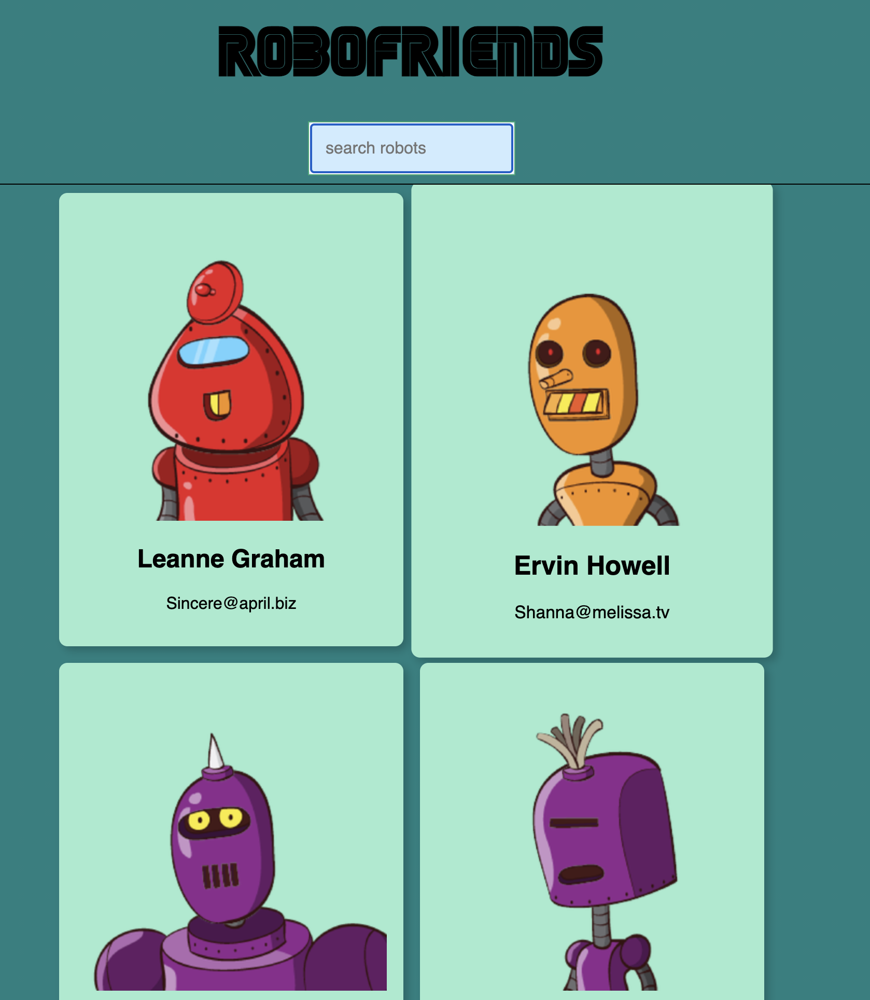
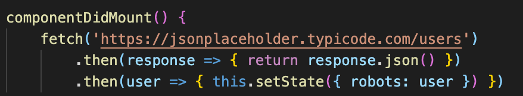
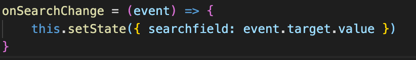

# RoboFriends

## Description

This is an app that searches robots from the robohash API and combines the contact information with the JSONPlaceholder.

## Table of Contents

- [Deployment](#deployment)
- [Usage](#usage)
- [Technologies](#technologies)
- [Highlights](#highlights)
- [Credits](#credits)
- [License](#license)

## Deployment

[Deployment](https://robofriends-david.netlify.app/)

This app is deployed using Netlify and by using continous integration from GitHub.

## Usage

You can search for robofriends in the search bar. The app will automatically render any matches with the values that you entered in.

## Technologies

### Languages

- HTML
- CSS
- JavaScript

### Libraries & Frameworks

- React (JavaScript)
- Tachyons (CSS)

### APIs

- [Robohash](https://robohash.org/)
- [JsonPlaceholder](https://jsonplaceholder.typicode.com/)

## Highlights

The lifecycle methold of componentDidMount() is used to make a fetch call to the JSON Placeholder.

Dynamically update what is being searched as the user types the values in.

## Credits

David Anusontarangkul

[ LinkedIn](https://www.linkedin.com/in/anusontarangkul/)
[ GitHub](https://github.com/anusontarangkul)

This app was apart of the "Complete Web Developer in 2021: Zero to Mastery" by Andrea Neagoie.

## License

